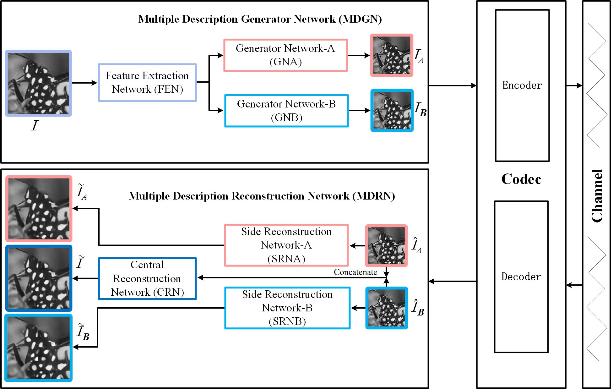
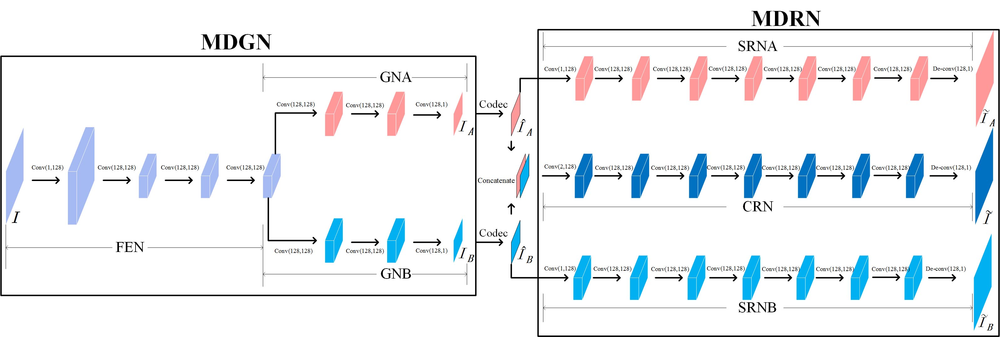

# MDCNN

## Multiple Description Convolutional Neural Networks for Image Compression ( IEEE Transactions on Circuits and Systems for Video Technology2019 ) Author锛歀ijun Zhao, Huihui Bai, Anhong Wang, Yao Zhao

## [[Results for Our Paper]](https://github.com/mdcnn/MDCNN_test40/tree/master/Figs)

## [[More Results for Other Testing Dataset]](https://github.com/mdcnn/Deep-Multiple-Description-Coding)

- Framework

  
  

- Networks

  
  
